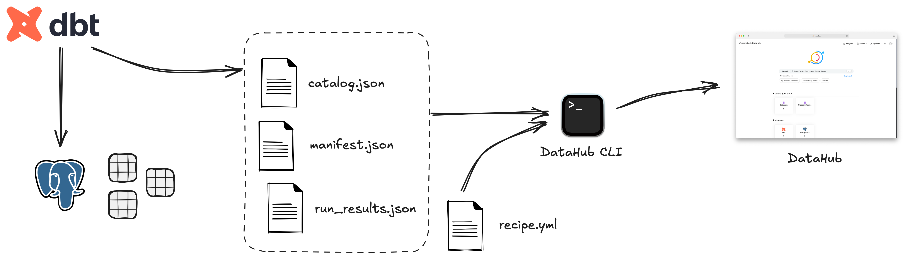

# dbt DataHub tutorial

A hands-on tutorial on ingesting dbt metadata into a locally running DataHub instance.



## Setup

### Requirements

- Python >= 3.11 (*)
- Poetry
- Docker Desktop

(*) The DataHub metadata ingestion CLI has [not been tested] for Python versions above 3.11.

[not been tested]: https://github.com/datahub-project/datahub/blob/5ee0b66920709516dcc6d372c83e197864cea7bf/metadata-ingestion/src/datahub/entrypoints.py#L50

## Usage

**Note**: These are minimal instructions. For more context, follow the [tutorial on Medium].

[tutorial on Medium]: https://medium.com/datashift-eu/dbt-to-datahub-a-practical-guide-to-metadata-ingestion-7bc15d56c72a

Install the project dependencies.

```bash
poetry install
```

Start DataHub using the [Docker quickstart].

```bash
poetry run datahub docker quickstart
```

[Docker quickstart]: https://datahubproject.io/docs/quickstart/#start-datahub

Start the Postgres database where dbt will build the models.
```bash
docker compose up -d
```

Test the dbt configuration.

```bash
docker compose run --rm dbt debug
```

Install dbt dependencies.

```bash
docker compose run --rm dbt deps
```

Generate dbt docs.

```bash
docker compose run --rm dbt docs generate
```

Build the dbt project.

```bash
docker compose run --rm dbt build
```

[Ingest] dbt metadata into DataHub.

```bash
poetry run datahub ingest -c datahub/recipe.yml
```

[Ingest]: https://datahubproject.io/docs/cli#ingest

Navigate to DataHub running at http://localhost:9002 and [sign in] with the default credentials (username: *datahub*, password: *datahub*).

[sign in]: https://datahubproject.io/docs/quickstart/#sign-in
